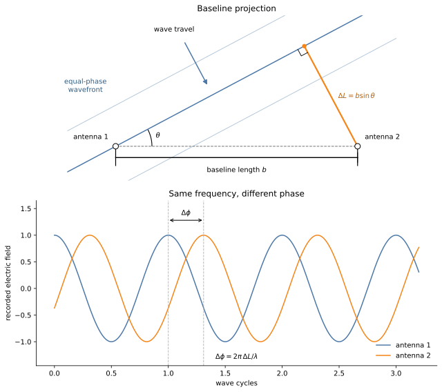
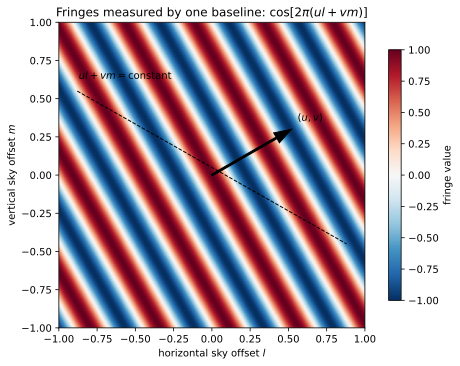

# Fourier transforms and VLBI imaging

Very long baseline interferometry does not record a photograph. Each pair of
telescopes measures a correlation between two copies of the same incoming
radio wave. The geometry of that correlation leads to a Fourier transform of
the sky brightness. This note derives that result, constructs the discrete
measurement matrix used by the code, and explains why image reconstruction
requires a prior.

The discussion ends with the coordinate network used in this repository.

## 1. A monochromatic plane wave

Let $\nu$ be the temporal frequency, $\lambda$ the observing wavelength, and $c_0 = \lambda\nu$ the propagation speed. The angular frequency $\omega$ and wavenumber $k$ are defined by

$$
\omega = 2\pi\nu, \qquad k = \frac{2\pi}{\lambda} = \frac{\omega}{c_0}.
$$

At a fixed reference position, a monochromatic scalar electric field with amplitude $E_0$ and initial phase $\phi_0$ is

$$
E(t) = E_0 \cos(\omega t + \phi_0).
$$

For a wave propagating along a spatial coordinate $z$, the field at position $z$ corresponds to the reference signal delayed by the transit time $z/c_0$:

$$
E(z, t) = E\!\left(0,\, t - \frac{z}{c_0}\right) = E_0 \cos\!\left(\omega\left(t - \frac{z}{c_0}\right) + \phi_0\right) = E_0 \cos(\omega t - kz + \phi_0).
$$

Surfaces of constant phase satisfy $\Phi(z, t) = \omega t - kz + \phi_0 = \text{constant}$. Differentiating with respect to time gives the phase velocity:

$$
\frac{d\Phi}{dt} = \omega - k\frac{dz}{dt} = 0 \implies \frac{dz}{dt} = \frac{\omega}{k} = c_0.
$$

Using the complex analytic signal representation where $E(z, t) = \operatorname{Re}[\widetilde E(z, t)]$:

$$
\widetilde E(z, t) = \mathcal{E}_0 \exp\left[ i(\omega t - kz) \right],
$$

where $\mathcal{E}_0 = E_0 e^{i\phi_0} \in \mathbb{C}$ encapsulates the initial amplitude and phase.

In three dimensions, let $\boldsymbol{r} \in \mathbb{R}^3$ denote the spatial position vector and $\boldsymbol{s}$ denote a unit vector pointing in the direction of propagation ($\|\boldsymbol{s}\|=1$). The wavevector is defined by

$$
\boldsymbol{k} = k\boldsymbol{s} = \frac{2\pi}{\lambda}\boldsymbol{s}.
$$

The spatial phase is $\boldsymbol{k}^\mathsf{T}\boldsymbol{r} = \frac{2\pi}{\lambda}\boldsymbol{s}^\mathsf{T}\boldsymbol{r}$. The three-dimensional plane wave is therefore

$$
\widetilde E(\boldsymbol{r}, t) = \mathcal{E}_0 \exp\left[ i(\omega t - \boldsymbol{k}^\mathsf{T}\boldsymbol{r}) \right] = \mathcal{E}_0 \exp\left[ 2\pi i\left(\nu t - \frac{\boldsymbol{s}^\mathsf{T}\boldsymbol{r}}{\lambda}\right) \right].
$$

Surfaces of constant phase $\boldsymbol{k}^\mathsf{T}\boldsymbol{r} = \text{constant}$ form planes perpendicular to $\boldsymbol{s}$.

## 2. Two receivers and a path difference

Consider two antenna stations located at positions $\boldsymbol{r}_1$ and $\boldsymbol{r}_2$. The baseline vector is

$$
\boldsymbol{b} = \boldsymbol{r}_2 - \boldsymbol{r}_1.
$$

The geometric path length difference for a wave arriving from direction $\boldsymbol{s}$ is the projection of the baseline onto the propagation direction:

$$
\Delta L = \boldsymbol{s}^\mathsf{T}\boldsymbol{b}.
$$

In planar geometry, let $\theta$ denote the angle between the baseline $\boldsymbol{b}$ and the wavefront. The baseline and projected path form a right triangle with hypotenuse $b = \|\boldsymbol{b}\|$ and opposite side $\Delta L$:

$$
\Delta L = b\sin\theta.
$$

Equivalently, with $\alpha = \pi/2 - \theta$ denoting the angle between the baseline and the propagation direction $\boldsymbol{s}$, $\Delta L = b\cos\alpha$.

The geometric path difference introduces a phase delay

$$
\Delta\phi = \boldsymbol{k}^\mathsf{T}\boldsymbol{b} = k\Delta L = \frac{2\pi}{\lambda}\Delta L = \frac{2\pi}{\lambda}b\sin\theta.
$$

For example, $\Delta L = \lambda/2 \implies \Delta\phi = \pi$, producing opposite phase at the two receivers. Phase is cyclic modulo $2\pi$, so a single baseline measurement does not uniquely identify the integer cycle count. Multi-baseline arrays and Earth rotation provide the additional constraints required for imaging.

## 3. Correlation measured by a baseline

For a single point source, the cross-correlation between the complex signals recorded at the two stations removes the common temporal oscillation:

$$
\begin{aligned}
\widetilde E(\boldsymbol{r}_1, t)\overline{\widetilde E(\boldsymbol{r}_2, t)}
&= |\mathcal{E}_0|^2 \exp\left[ -i\boldsymbol{k}^\mathsf{T}(\boldsymbol{r}_1 - \boldsymbol{r}_2) \right] \\
&= |\mathcal{E}_0|^2 \exp\left[ i\boldsymbol{k}^\mathsf{T}\boldsymbol{b} \right] \\
&= |\mathcal{E}_0|^2 \exp\left[ \frac{2\pi i}{\lambda}\boldsymbol{s}^\mathsf{T}\boldsymbol{b} \right].
\end{aligned}
$$

The time-averaged correlation is the complex visibility $V(\boldsymbol{b})$. Its amplitude is proportional to source flux and its phase is determined by the geometric path difference $\boldsymbol{k}^\mathsf{T}\boldsymbol{b}$.

## 4. Phase center and sky coordinates

An interferometer tracks a chosen direction
$\boldsymbol{s}_0$, called the phase center. The correlator removes the
geometric delay expected from that direction. What remains is the phase
associated with the offset

$$
\boldsymbol{s}-\boldsymbol{s}_0.
$$

Choose three orthogonal axes:

- $\boldsymbol{e}_l$, horizontal on the local sky plane;
- $\boldsymbol{e}_m$, vertical on the local sky plane;
- $\boldsymbol{e}_w=\boldsymbol{s}_0$, toward the phase center.

Write a source direction as

$$
\boldsymbol{s}
=
l\boldsymbol{e}_l
+
m\boldsymbol{e}_m
+
n\boldsymbol{e}_w,
$$

where

$$
n=\sqrt{1-l^2-m^2}.
$$

The quantities $l$, $m$, and $n$ are direction cosines. For a small
field of view, $l$ and $m$ are approximately angular offsets in radians.

Express the baseline in the same coordinate system and divide by wavelength:

$$
\frac{\boldsymbol{b}}{\lambda}
=
u\boldsymbol{e}_l
+
v\boldsymbol{e}_m
+
w\boldsymbol{e}_w.
$$

The phase remaining after removal of the phase-center delay is

$$
\begin{aligned}
\frac{\boldsymbol{b}^{\mathsf T}
(\boldsymbol{s}-\boldsymbol{s}_0)}
{\lambda}
&=
\left(
u\boldsymbol{e}_l
+
v\boldsymbol{e}_m
+
w\boldsymbol{e}_w
\right)^{\mathsf T}
\\
&\quad
\left(
l\boldsymbol{e}_l
+
m\boldsymbol{e}_m
+
(n-1)\boldsymbol{e}_w
\right)
\\
&=
ul+vm+w(n-1).
\end{aligned}
$$

This is the geometric origin of $ul+vm$. It is a dot product between a
baseline measured in wavelengths and a sky direction measured relative to the
phase center.

For a narrow field,

$$
n
=
\sqrt{1-l^2-m^2}
\approx
1-\frac{l^2+m^2}{2}.
$$

The term $w(n-1)$ is then small or can be corrected separately. The
remaining phase is

$$
2\pi(ul+vm).
$$

## 5. One baseline measures a fringe

Fix a baseline $(u,v)$. Across the image plane, the real part of its phase
kernel is

$$
\cos
\left[
2\pi(ul+vm)
\right].
$$

Locations satisfying

$$
ul+vm=\text{constant}
$$

have equal phase and lie on parallel lines. The baseline compares the sky
brightness with this fringe pattern.

The vector $(u,v)$ is normal to the equal-phase lines. A short projected
baseline produces slowly varying fringes and measures broad image structure.
A long baseline produces narrow fringes and measures finer detail.

The complex kernel contains both cosine and sine patterns:

$$
e^{-2\pi i(ul+vm)}
=
\cos[2\pi(ul+vm)]
-
i\sin[2\pi(ul+vm)].
$$

The real and imaginary visibility components are the image correlations with
those two patterns.

## 6. From point sources to a brightness field

Let $I(l,m)$ be sky brightness. Radiation emitted from distinct sky
directions is modeled as spatially incoherent, so cross terms vanish under
time averaging. The contributions from separate directions add.

Under the narrow-field approximation, the visibility measured at baseline
$(u,v)$ is

$$
V(u,v)
=
\int_{\mathbb R^2}
I(l,m)
e^{-2\pi i(ul+vm)}
\,dl\,dm.
$$

This is the two dimensional Fourier transform:

$$
\boxed{
V(u,v)=\mathcal F[I](u,v)
}.
$$

The full noncoplanar expression is

$$
V(u,v,w)
=
\int
\int
\frac{I(l,m)}{n}
e^{-2\pi i[ul+vm+w(n-1)]}
\,dl\,dm.
$$

The EHT image field is small enough that the flat two dimensional model is a
useful approximation for the calculations in this repository.

## 7. Discrete image and measurement matrix

Divide the image into $N=HW$ pixels. Let pixel $p$ have center
$(l_p,m_p)$, and let $x_p$ denote its integrated flux. Replacing the
visibility integral with a sum gives

$$
\widehat y_q
=
\sum_{p=1}^{N}
x_p
P_q
e^{-2\pi i(u_q l_p+v_q m_p)}.
$$

Index $q$ identifies one measured visibility. The factor $P_q$ denotes
the Fourier response of the adopted pixel pulse at that baseline. Pixel-area
factors may instead be absorbed into $x_p$, depending on the image
convention.

Define

$$
A_{q,p}
=
P_q
e^{-2\pi i(u_q l_p+v_q m_p)}.
$$

Then

$$
\widehat y_q
=
\sum_{p=1}^{N}
A_{q,p}x_p.
$$

Stacking all $M$ measurements produces

$$
\boxed{
\widehat y=Ax
},
$$

with

$$
A\in\mathbb C^{M\times N}.
$$

Row $q$ is the fringe pattern for one measured baseline and time. Column
$p$ gives the contribution of one image pixel to every measurement.

The matrix $A$ does not contain the measured visibility values or their
uncertainties. The three objects have separate roles:

$$
A
=
\text{image-to-measurement map},
$$

$$
y
=
\text{measured visibilities},
$$

$$
\sigma_q
=
\text{noise standard deviation of measurement }q.
$$

Ehtim constructs this matrix from the observation coordinates, image field of
view, pixel grid, and pulse convention. The function
`chisqdata_vis` returns $y$, $\sigma$, and $A$ separately.

## 8. Regular and nonuniform Fourier sampling

The discrete Fourier transform $F$ evaluates an image on a regular
frequency grid. If every measured $(u_q,v_q)$ coincided with a grid cell,
the measurement operator could be written

$$
A=SF,
$$

where $S$ selects measured rows of $F$.

Actual baseline coordinates vary continuously. They are not generally integer
multiples of the FFT grid spacing. Direct evaluation uses the phase kernel at
the measured coordinates:

$$
A_{q,p}
\propto
e^{-2\pi i(u_q l_p+v_q m_p)}.
$$

This is a nonuniform discrete Fourier transform. An NFFT accelerates the same
calculation by interpolating between a regular Fourier grid and the requested
nonuniform frequencies.

The factorization $A=SF$ remains useful for intuition. With off-grid data,
$S$ must be understood as an interpolation and sampling operator rather than
a binary row selector.

## 9. Earth rotation and Fourier coverage

The physical baseline between two telescopes is fixed to Earth. Its projection
onto the sky plane changes as Earth rotates. One telescope pair therefore
traces a curve through the $(u,v)$ plane during an observation.

Each projected baseline contributes one Fourier sample at a given time.
Multiple telescope pairs trace different curves. The union of these samples
is the Fourier coverage of the observation.

Large gaps remain because the number of telescope pairs and observation times
is finite. Those gaps are the source of the imaging ambiguity. No algorithm
can recover their contents from the likelihood alone.

## 10. Why direct inversion fails

The linear model is

$$
y=Ax+\epsilon.
$$

For the current 100 by 100 VLBI problem,

$$
A\in\mathbb C^{1030\times10000}.
$$

There are more pixel values than measured visibilities. The matrix is
rectangular and has a nontrivial null space:

$$
\mathcal N(A)
=
\{z:Az=0\}.
$$

If $z\in\mathcal N(A)$, then

$$
A(x+z)=Ax.
$$

The data cannot distinguish $x$ from $x+z$. An ordinary inverse
$A^{-1}$ does not exist.

A pseudoinverse selects one solution, commonly the minimum-norm solution, but
that choice is itself a prior. Noise and small singular values can also make
the pseudoinverse unstable.

Image reconstruction therefore combines the likelihood with assumptions
about plausible images. CLEAN uses a component model. Regularized maximum
likelihood methods use explicit penalties. A coordinate network imposes an
implicit prior through its architecture and optimization.

## 11. The weighted adjoint and dirty image

Let

$$
W
=
\operatorname{diag}
\left(
\sigma_1^{-2},\ldots,\sigma_M^{-2}
\right)
$$

be the visibility weight matrix. Applying the weighted adjoint gives the dirty
image, up to normalization:

$$
x_{\mathrm{dirty}}
=
A^{\mathsf H}Wy.
$$

Substitute the noiseless model $y=Ax$:

$$
x_{\mathrm{dirty}}
=
A^{\mathsf H}WAx.
$$

The matrix

$$
H_{\mathrm{image}}
=
A^{\mathsf H}WA
$$

is the image-space normal operator. It is not generally the identity, so the
dirty image is not the true image.

For ideal gridded sampling, let

$$
A=SF.
$$

Then

$$
x_{\mathrm{dirty}}
=
F^{\mathsf H}S^{\mathsf H}WSFx.
$$

Ignoring the chosen DFT normalization, define the weighted sampling function

$$
M=S^{\mathsf H}WS.
$$

This is diagonal in the Fourier grid. Measured cells contain accumulated
inverse noise weights, while unmeasured cells contain zero. Hence

$$
x_{\mathrm{dirty}}
\propto
F^{-1}MFx.
$$

Multiplication by $M$ in Fourier space becomes convolution in image space:

$$
\boxed{
x_{\mathrm{dirty}}
=
b_{\mathrm{dirty}}*x
},
$$

where

$$
b_{\mathrm{dirty}}
\propto
F^{-1}M.
$$

The dirty beam is the image formed by a point source. Sparse Fourier coverage
produces a narrow central response surrounded by sidelobes. Every source in
the dirty image is convolved with that pattern.

## 12. CLEAN deconvolution

CLEAN models the sky as a collection of compact components. In the original
algorithm, each component is a point source. Begin with the dirty image as the
residual and an empty component model.

At one iteration, let the largest residual value be $a$ at pixel $p$.
Choose a loop gain $0<\gamma<1$. Add

$$
\gamma a\,\delta_p
$$

to the component model, where $\delta_p$ is a point source at $p$. A point
source produces a shifted dirty beam, so subtract

$$
\gamma a\,
b_{\mathrm{dirty}}(\,\cdot-p\,)
$$

from the residual.

The loop repeats until the peak residual falls below a stopping threshold or
a set number of iterations is reached. The final component model consists of
point locations and amplitudes.

The component model is convolved with a clean beam, usually a Gaussian fitted
to the central lobe of the dirty beam. Adding the remaining residual produces
the restored CLEAN image.

CLEAN is an iterative deconvolution under a sparse-component assumption. It
does not construct $A^{-1}$. Multiscale CLEAN extends the component
dictionary to represent extended emission more efficiently.

## 13. Regularized inverse imaging

Many reconstruction methods solve

$$
\widehat x
=
\operatorname*{arg\,min}_x
\left[
\frac{1}{2}
(Ax-y)^{\mathsf H}
W
(Ax-y)
+
R(x)
\right].
$$

The first term measures agreement with the visibilities. The regularizer
$R(x)$ chooses among images that fit the incomplete data. Common choices
favor smoothness, sparsity, positivity, compact support, or maximum entropy.

Different regularizers can produce different images with similar visibility
loss. This is expected in an underdetermined problem. The data constrain only
the directions outside the null space.

## 14. Neural image parameterization

This repository replaces the free pixel vector $x$ with a coordinate
network. For pixel coordinate

$$
u_p=(l_p,m_p),
$$

the network predicts

$$
x_{\theta,p}
=
f_\theta(u_p).
$$

Evaluating all coordinates produces

$$
x_\theta
=
\begin{bmatrix}
f_\theta(u_1)\\
\vdots\\
f_\theta(u_N)
\end{bmatrix}.
$$

The predicted visibilities are

$$
\widehat y_\theta
=
A x_\theta.
$$

Training solves

$$
\theta^\star
=
\operatorname*{arg\,min}_\theta
\frac{1}{2}
\left(
A x_\theta-y
\right)^{\mathsf H}
W
\left(
A x_\theta-y
\right).
$$

The network is not an implementation of $A^{-1}$. It defines a restricted
family of images, and optimization searches that family for one whose
visibilities match the data. Architecture, positional encoding, initialization,
and optimization all influence which solution is selected from the
underdetermined inverse problem.

Once $\theta^\star$ has been fitted, uncertainty can be studied in several
parameterizations. Deformation BayesRays perturbs input coordinates. Network
Laplace perturbs $\theta^\star$. The Fourier information calculation adds
coefficients after the network:

$$
x(c)
=
x_{\theta^\star}
+
F^{-1}c.
$$

The derivation of the resulting coefficient information and posterior
approximation begins in
[`fourier_information_derivation.md`](fourier_information_derivation.md).

## References

- A. R. Thompson, J. M. Moran, and G. W. Swenson Jr.,
  *Interferometry and Synthesis in Radio Astronomy*, third edition, Springer,
  2017.
- J. D. Monnier and R. J. Allen,
  ["Radio and Optical Interferometry: Basic Observing
  Techniques and Data Analysis,"](https://arxiv.org/abs/1201.2963)
  2013.
- J. A. Högbom,
  ["Aperture Synthesis with a Non-Regular Distribution of Interferometer
  Baselines,"](https://ui.adsabs.harvard.edu/abs/1974A%26AS...15..417H)
  *Astronomy and Astrophysics Supplement*, 1974.
